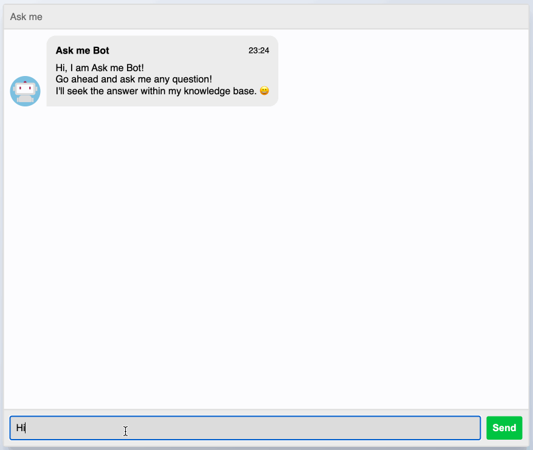

# Ask me

Ask me is a proof of concept (PoC) of the use of OpenAI GPT that allows you to ask questions based on the content of a particular knowledge base (corpus), for example, your website, your organization regulatory framework, guidance, or a particular set of documents.

It is based on the OpenAI tutorial that explains how to make a [Q&A for a web content](https://platform.openai.com/docs/tutorials/web-qa-embeddings)



## What are the steps to create your own Chat Bot?

1) **Gather the corpus with the base of knowledge you want to use** For example, a set of webpages PDF, markdown, word files, etc. Create the corpus with the content that has the answers to the questions.

2) **Convert the corpus to txt files**. Convert those files into plain text. We need this step because the model that generates the answer needs plain text as input.

3) **Create a set of embeddings**. Embeddings is a way to translate information into a format (usually a vector of numbers) that machine learning algorithms can use to make predictions or decisions. In our case the embeddings are used to find the documents that most probably have the information that can be used to generate the answer to our question. To create the embeddings the text files will be broken in chunks and create embeddings for each chunk.


## Setup

Pre-requisites:

* Python (it was tested with v3.9)
* [OpenAI account](https://platform.openai.com/), and and [API key](https://platform.openai.com/account/api-keys). You get $18 USD of free credits for testing.


After cloning this repo (`git clone https://github.com/merlos/ask-me/`):

1. Activate the virtual environment 
    ```shell
    source venv/bin/activate
    ```
2. Install requirements
    ```shell
    pip install -r requirements.txt
    ```
3. Set the OpenAI API key environment variable
  
    ```shell

    # OSX and GNU/Linux
    export OPENAI_API_KEY=<your key>

    # Windows
    setenv OPENAI_API_KEY=<your key>
    ```
  
  Then, you can test the API is working by running

  ```shell
  python openai_api_test.py
  ```

## Usage

### Step 1: Collect the data and convert it in plain text.

The goal of this step is to gather the data that will be used as corpus. In the repo a few scripts are provided:

 1. `scrapper.py` it takes as argument an URL and goes through all the pages within the domain. For example:

    ```shell
    python scrapper.py https://www.merlos.org
    ```
    This will create the folder `./text/www.merlos.org/` with the scrapped pages in text format.


2. `DownloadSharePointDocs.ps1` This powershell script downloads the files from a SharePoint library.

    ```powershell
    # In a powershell prompt
    .\DownloadSharePointDocuments.ps1 -SiteUrl "https://<tenant-name>.sharepoint.com/sites/yoursite/" 
                                      -LibraryName "Library"
                                      -DownloadFolder "./LibraryDocuments"
    ```
    Note that `DownloadFolder` must exist. The script downloads the required powershell modules.

    To run it on a GNU/Linux or a Mac you need to install [PowerShell](https://github.com/PowerShell/PowerShell) (f.i `brew install pwsh`).


3. `pdftotext.py` This script takes a folder with a set of PDFs and converts them into txt files

    ```shell
    python pdftotext ./path/with/pdfs --output ./text/filesfolder/
    ```


**Note:** _This step can be replaced with a conversion of any kind of file into text. For example Word Processor files, presentations, etc. The only requirement is to place the documents converted into plain text, i.e. `.txt`, in a folder for the next step._


### Step 2: Process the data.

Run the following script indicating what is the folder with the text files from the previous step.

```shell
python process.py ./text/www.merlos.org
```

This script will output the files: (1) `processed/corpus.csv`, which is just a list of the txt files in one single csv files, and (2) `processed/embeddings.csv` that includes the embeddings. 

During the implementation it was noticed that the reliability of OpenAPI was poor. It returned errors in many ocasions, specially an overloaded API error:
```
Error processing batch 124: The server is currently overloaded with other requests. Sorry about that! You can retry your request, or contact us through our help center at help.openai.com if the error persists.
```

This may have been because I was in the free tier, but in any case,

1) Added idle time. I separated the calls to the openAI API 6 seconds by default. In `config.py` it can be setup modifying `CONFIG['idle_time']`.
2) Processed the embeddings in batches. In case there is an error, when relaunched, process.py will pick up starting from the last saved batch. By default the batch is 10. You can setup the batch size in `config.py` modifying `CONFIG['batch_size']`.

If you want to process a new corpus but you have an uncompleted the processing of an existing corpus you need to delete all the files with the name `processed_batch*` within the processed folder:

```shell
rm processed/processed_batch*
```
Lastly, if the process is broken too many times because of the API errors, you can use this loop to automate relaunching the script till it is done.

```shell
until python3 process.py ./text/folder-with-txt-files; do echo "Restarting...";done
```

Definitely, this step is the most painful, specially if you have a large corpus of knowledge. 

## Step 3: Asking questions

Now it is time to ask the questions to the AI. You can use the command line script `ask.py` with the question as argument.

```shell
python ask.py "Who is Juan?"
```

Alternatively you can test the output on a browser, run the script:

```shell
python web.py
```

Then open a browser with the address http://localhost:5000

Finally, you can also query the API of `web.py` manually by making a `POST` at the endpoint http://localhost:5000/api/answers
with a JSON body like this:

```json
{"question": "Who is Juan?"}
```
The response is something like:
```json
{ 
    "question": "Who is Juan?",
    "answer": "The answer provided by OpenAI API"
}
```

## Using Docker

You can also run the output in docker.

Edit `Dockerfile` to add your `OPENAI_API_KEY` by replacing the line
```dockerfile
ENV OPENAI_API_KEY="your_api_key_here"
```

First, build the image

```shell
# Build for the same architecture of your computer
docker build -t ask_me .

# To build forcing a X86 (aka amd64) architecture. For example if you are in a M1 chip and you want to run in the cloud with 
docker buildx build --platform linux/amd64 -t ask_me .

```
Then run the image locally

```shell
docker run -p 8000:80 --name ask_me -v `pwd`/log:/home ask_me
```
Notes:
 - The file `gunicorn_config_docker.py` is used to setup gunicorn. Check it out!
 - Gunicorn web server in bound in port 80 within the container. However in `-p 80:8000` we are forwarding it to port 8000 in our local machine, so you need to open <http://localhost:8000>.
 - The option ```-v `pwd`/log:/home``` will add a volume in the folder `./log` of your machine and mapped to `/home` in the container. Error and access logs are stored in `/home` within the Docker instance.
 - You should not upload this image into a public docker registry as it would expose your OpenAI API key. Alternatively, you can setup the environment variable following the instructions of your cloud provider.
 - No `https` is added.

## What happens behind the scenes when you ask a question?

1) The first thing that will be done is to try to find the chunks of text that most probably have the answer to the question. To do that we'll pass the embeddings and the question to one of the OpenAI endpoints API.

2) Once we have the text that most likely have the answer, we'll ask the AI behind ChatGPT (i.e GPT) to build an answer based on the chunks of text attached. 


## References

* Tutorial to make Q&A using OpenAI API https://platform.openai.com/docs/tutorials/web-qa-embeddings
* Source code of the tutorial https://github.com/openai/openai-cookbook/tree/main/solutions/web_crawl_Q%26A
* A more advanced version using [Dagster](https://dagster.io) and [LangChain](https://github.com/hwchase17/langchain) https://dagster.io/blog/chatgpt-langchain
* A version using [LangChain](https://github.com/hwchase17/langchain) and a Notion DB https://github.com/hwchase17/notion-qa 


* For improving a large corpus embedding search performance https://platform.openai.com/docs/guides/embeddings/how-can-i-retrieve-k-nearest-embedding-vectors-quickly

## Attributions

* The work done by [Gobierto in their questions and answers](https://www.gobierto.es/blog/gobierto-preguntas-valoracion-de-las-primeras-respuestas-generadas) was the source of inspiration. 
* User interface is based on this CodePen of Shajad Hasemian https://codepen.io/sajadhsm/pen/odaBdd (Copyright (c) 2023 by Sajad Hashemian - MIT License)

## LICENSE MIT

Copyright (c) 2023 @merlos.

Permission is hereby granted, free of charge, to any person obtaining a copy of this software and associated documentation files (the "Software"), to deal in the Software without restriction, including without limitation the rights to use, copy, modify, merge, publish, distribute, sublicense, and/or sell copies of the Software, and to permit persons to whom the Software is furnished to do so, subject to the following conditions:

The above copyright notice and this permission notice shall be included in all copies or substantial portions of the Software.

THE SOFTWARE IS PROVIDED "AS IS", WITHOUT WARRANTY OF ANY KIND, EXPRESS OR IMPLIED, INCLUDING BUT NOT LIMITED TO THE WARRANTIES OF MERCHANTABILITY, FITNESS FOR A PARTICULAR PURPOSE AND NONINFRINGEMENT. IN NO EVENT SHALL THE AUTHORS OR COPYRIGHT HOLDERS BE LIABLE FOR ANY CLAIM, DAMAGES OR OTHER LIABILITY, WHETHER IN AN ACTION OF CONTRACT, TORT OR OTHERWISE, ARISING FROM, OUT OF OR IN CONNECTION WITH THE SOFTWARE OR THE USE OR OTHER DEALINGS IN THE SOFTWARE.
